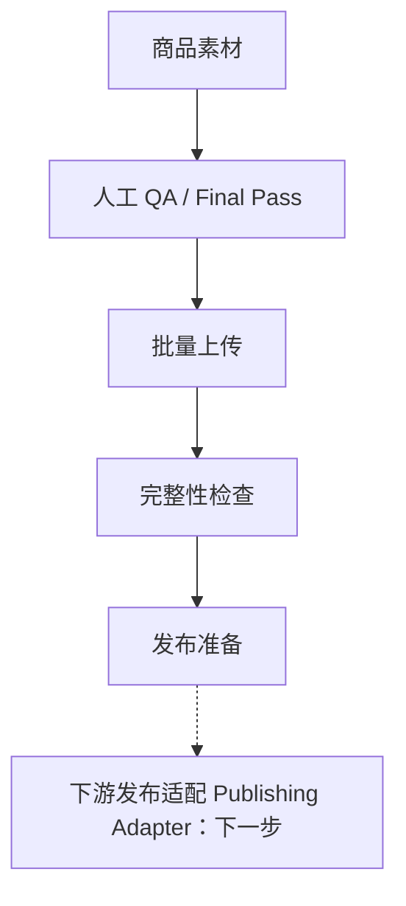
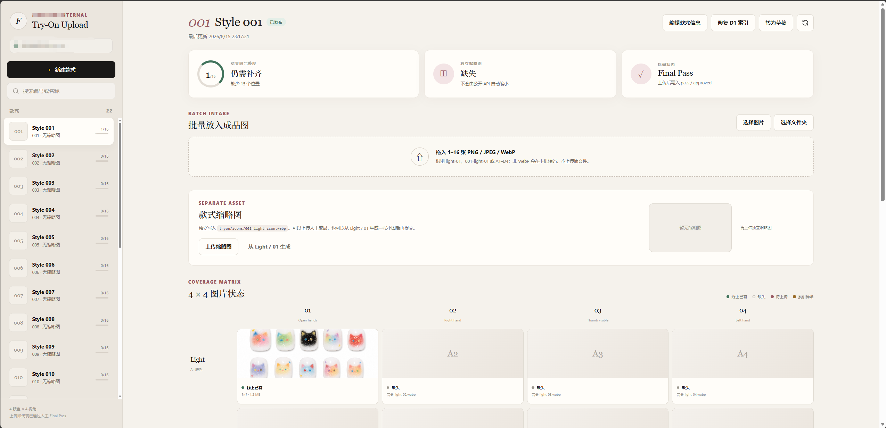

# AI Commerce Asset Ops

用于管理 AI 商品素材上传、完整性检查、QA 和发布状态的电商内部工具。

[English](./README_EN.md)

## 为什么做这个

这个项目来自一次跨境电商虚拟试戴项目。

前面的 AI 生成流程跑起来以后，我发现真正麻烦的不只是“把图生成出来”。一个 SKU 会对应多张不同肤色、视角的结果图，人工通过文件夹管理时，很容易少图、放错位置、不清楚哪些已通过审核，或者把已经上传的图片再传一遍。到了发布前，还要重新打开文件夹逐张核对。

所以我做了这个内部工具原型，把生成后的素材管理、QA 记录和发布准备集中起来。打开一个款式，就能看到已有多少张图、缺哪些位置，以及这次上传会新增、跳过还是覆盖哪些图片。

## 它现在能做什么

- 按三位数款式编号管理 SKU，创建和编辑名称、备注，以及可后补的 Shopify Variant ID。
- 用 4 种肤色 × 4 个视角的矩阵展示 16 张结果图，标出缺失图片和索引异常。
- 批量选择文件或文件夹，按文件名匹配位置；无法识别的文件可以手动指定。
- 差异上传，已有图片默认跳过；覆盖需要确认，并检查图片版本，防止覆盖别人刚更新的内容。
- 接收人工 Final Pass 后的图片，上传时记录 QA 通过状态、操作人和上传结果。
- 在浏览器中将 PNG/JPEG 转成 WebP；缩略图可以单独上传，也可以从 Light/01 生成后预览提交。
- 将图片存到 R2、索引和状态存到 D1，并根据已有图片补齐缺失的数据库索引。
- 管理草稿和发布状态；切换到发布前，检查 16 张结果图、缩略图及对应索引是否齐全。

## 使用流程



当前系统负责素材接收、完整性检查、QA 记录、业务状态和发布准备。图片在上传前经过人工 Final Pass，系统在入库时记录通过状态。界面里的“发布”只是内部 release/readiness 状态，不代表已经向 Shopify 或其他外部平台执行发布；实际发布属于后续的下游集成与适配层。

例如，款式 001 已有 Light/01，其余 15 张缺失，页面会显示 1/16。放入整组图片后，已有位置默认跳过；需要换图时，再单独选择覆盖并确认。

## 界面

Upload Studio 实际界面（已脱敏）：款式列表、1/16 完整度、独立缩略图和图片状态矩阵。



## 技术实现

- Cloudflare Workers：API 和应用服务
- Cloudflare R2：图片文件
- Cloudflare D1：SKU、图片索引、QA 和发布状态、上传记录
- TypeScript：后端逻辑
- 原生 HTML、CSS、JavaScript：前端界面和浏览器图片处理

## 为什么将图片资产与业务状态分开

R2 保存图片二进制文件，D1 保存 SKU、肤色与视角位置（slot）、QA 和 release 状态。文件回答“图片在哪里”，数据库回答“它属于哪个位置、是否经过人工终审、款式当前是什么状态”。分开存储后，查询和更新这些信息不需要重新处理图片。

两边也可能不一致：图片已经上传，但索引写入失败；数据库有记录，文件却已缺失。因此，发布就绪不能只看文件是否存在。当前系统会同时核对 R2 文件与 D1 索引，提示异常并支持补齐索引；从草稿切换到发布时，要求 16 张结果图、缩略图及对应索引齐全。QA 通过状态来自上传前的人工终审，并在入库时记录。

## 本地运行

需要 Node.js 22 或更新版本。在仓库目录执行：

```bash
npm ci
npx wrangler d1 migrations apply asset-ops-db --local
npm run dev
```

开发命令已配置本地测试身份，图片和数据库使用 Wrangler 本地存储。检查类型、前端语法和集成测试：

```bash
npm run check
```

## 下一步

以下功能尚待实现：

- Shopify / 电商平台发布适配器
- 发布任务队列和失败重试
- Webhook / ERP / 下游系统集成
- 更完整的审核与权限记录

## 项目说明

这是从真实业务问题中抽离出的公开展示版本，仓库不包含客户数据、生产凭证和商业素材。
