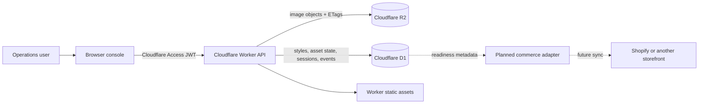
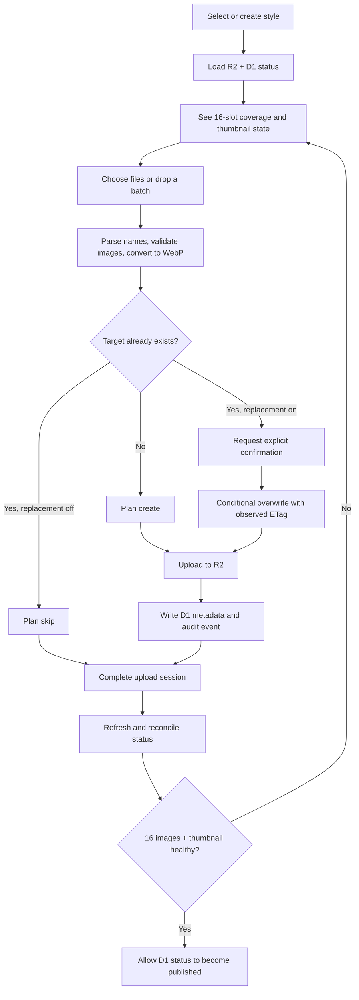

# AI Commerce Asset Ops

> AI-generated e-commerce asset intake, QA, state tracking and publishing workflow.

AI Commerce Asset Ops is a portfolio-ready reference implementation of an internal operations tool for teams that prepare AI-generated product imagery for e-commerce. It turns a folder of human-approved images into a controlled, observable asset workflow: validate the expected coverage, upload only what changed, guard overwrites, reconcile object storage with metadata, and mark a style ready for downstream publishing.

中文简介：这是一个面向电商团队的 AI 图片资产运营工具原型，用于接收人工终审后的图片、检查素材完整度、差异化上传、记录状态，并为后续商城发布做好准备。

## Overview

Generative image pipelines can produce many product variants quickly, but the operational work after generation is easy to underestimate. A single style may need multiple skin tones, camera views, a thumbnail, consistent naming, review evidence, safe replacement behavior, and a reliable answer to a simple question: **is this style actually ready?**

This project models that last-mile workflow for a fixed 4 × 4 image matrix:

- four skin tones: `light`, `medium`, `tan`, and `deep`;
- four views: `01` through `04`;
- sixteen final-pass result images per style;
- one independently stored thumbnail per style.

The current application is a Cloudflare Worker serving a browser-based internal console. R2 stores image objects, D1 stores operational metadata and audit events, and Cloudflare Access protects the API in deployed environments.

## The Problem

Asset operations teams need more than a bulk upload button:

- incomplete image sets must be visible before release;
- existing assets should not be uploaded again by accident;
- deliberate replacements need an explicit confirmation and concurrency protection;
- storage objects and database records can drift and need reconciliation;
- product identifiers may arrive later and still need to be editable;
- readiness must be based on verifiable coverage, not an operator's memory.

## The Solution

AI Commerce Asset Ops provides a compact control plane around final, human-reviewed e-commerce imagery. Operators select or create a three-digit style, inspect its coverage matrix, add a batch of files, review the proposed create/skip/overwrite plan, and upload. The Worker validates every write, stores the WebP object in R2, records metadata and audit events in D1, and exposes a status endpoint that compares both systems.



The dotted path is deliberately marked as planned: this repository does **not** call the Shopify Admin API or publish assets to a live storefront.

## Current Capability

Implemented in this repository:

- internal responsive web console served by a Cloudflare Worker;
- create and edit three-digit style/SKU records, including an optional commerce variant ID;
- real-time 4-tone × 4-view coverage inspection;
- batch intake with filename parsing and cell assignment;
- browser-side PNG/JPEG/WebP validation and WebP conversion;
- missing-asset detection and differential upload planning;
- skip existing assets by default;
- explicit overwrite confirmation and `If-Match`/ETag concurrency checks;
- independent thumbnail upload, with an option to derive it locally from `light/01`;
- R2 object storage plus D1 metadata, upload sessions, and event history;
- R2/D1 drift detection and one-click metadata reconciliation;
- publish-readiness gate requiring all 16 result images and a healthy thumbnail;
- Cloudflare Access JWT verification in deployed environments;
- integration tests covering authentication, status, upload, overwrite conflict, repair, and publish gating.

Planned, but not represented as complete:

- generation of AI images inside the application;
- automated visual-quality scoring or model-based moderation;
- Shopify Admin API discovery, variant synchronization, or storefront publishing;
- background queues, retry orchestration, and webhook processing;
- robotic process automation for systems without an API;
- granular role-based authorization beyond the Cloudflare Access policy.

## Core Features

### Coverage as an operational state

Each style has 16 required result slots. The UI renders each slot as missing, healthy, unindexed, or orphaned by comparing the object in R2 with its D1 record. A thumbnail is checked separately because it is a distinct deliverable, not merely a display transformation.

### Differential uploads

The browser builds an upload plan before changing storage:

- **create** when a required object does not exist;
- **skip** when the object already exists and replacement was not requested;
- **overwrite** only after the operator chooses replacement and confirms the action.

For overwrites, the client sends the previously observed ETag. The Worker uses conditional R2 writes so a stale screen cannot silently replace a newer object.

### Human-reviewed input

This application starts after image generation and human final pass. Successful uploads are recorded as `qa_status = pass` and `visual_status = approved`. It does not claim to perform the creative review itself.

### Auditability and repair

Upload sessions capture intended and completed create/overwrite counts. Individual events retain actor, style, slot, object key, prior/new ETag, dimensions, size, status, and failure detail. A reconciliation endpoint can rebuild missing D1 metadata from the current R2 objects without re-uploading images.

## Why R2 + D1

R2 and D1 solve different parts of the workflow:

| Concern | Service | Reason |
| --- | --- | --- |
| Binary image storage | Cloudflare R2 | Object semantics, metadata, ETags, conditional writes, and no database blob overhead |
| Operational state | Cloudflare D1 | Queryable style records, coverage metadata, upload sessions, audit history, and release status |
| API and UI delivery | Cloudflare Workers | One deployment surface close to storage, with static assets and Access-aware request handling |

Keeping objects and metadata separate creates a consistency problem by design; the status and repair flows make that problem observable and recoverable.

## Workflow



In the current implementation, “published” is an internal D1 readiness status. It is not evidence that a product or image has been published to an external commerce platform.

## Automation Design

The implementation emphasizes deterministic operations before autonomous automation:

1. **Discover** — read style metadata and compare expected keys with R2 and D1.
2. **Plan** — classify each selected asset as create, skip, or overwrite.
3. **Confirm** — require a human decision for destructive replacement.
4. **Execute** — use bounded WebP uploads and conditional writes.
5. **Record** — persist session totals and per-object audit events.
6. **Verify** — reload state from storage and gate release on complete coverage.
7. **Extend** — attach a queue or commerce adapter later without weakening the upload contract.

This shape supports future event-driven automation while keeping the existing workflow inspectable and safe.

## Engineering Decisions

- **Fixed naming contract:** result objects use `tryon/results/{style}-{tone}-{view}.webp`; thumbnails use `tryon/icons/{style}-light-icon.webp`.
- **Server-side validation:** style, tone, view, MIME type, content length, image signature, dimensions, upload session, and overwrite preconditions are validated by the Worker.
- **Bounded uploads:** the sample limit is 12 MiB per source image; request bodies are not accepted without a known, valid content length.
- **Optimistic concurrency:** overwrite operations require the current ETag and fail with a conflict if the object changed.
- **Independent thumbnail lifecycle:** the thumbnail is uploaded and tracked as its own object. The UI may generate a candidate from `light/01`, but the server does not silently resize images.
- **Readiness over side effects:** release status is gated locally; external publishing remains an explicit adapter boundary.
- **Zero-trust deployment:** production requests are expected to arrive through Cloudflare Access and are verified against the configured audience.
- **Public-safe defaults:** deployment identifiers are placeholders, development auth is local-only, and production configuration checks block accidental deployment with example values.

## Screenshots

Screenshots are intentionally omitted from this public repository. The original operational interface contained customer-specific records, deployment identifiers, and commercial imagery. Publishing fabricated screenshots would misrepresent the project, while publishing real screens would risk private data. A future public demo can add screenshots after a clearly labeled, synthetic demo dataset and deployment are available.

See [`docs/images/README.md`](docs/images/README.md) for the screenshot policy.

## Tech Stack

- TypeScript
- Cloudflare Workers and Workers Static Assets
- Cloudflare R2
- Cloudflare D1
- Cloudflare Access JWT validation with `jose`
- Vanilla HTML, CSS, and JavaScript
- Vitest with `@cloudflare/vitest-pool-workers`
- Wrangler
- GitHub Actions

## Local Development

Prerequisites:

- Node.js 22 or newer
- npm
- a Cloudflare account only when testing remote resources or deploying

Install dependencies:

```bash
npm ci
```

Create local development variables. On macOS/Linux:

```bash
cp .dev.vars.example .dev.vars
```

On PowerShell:

```powershell
Copy-Item .dev.vars.example .dev.vars
```

Apply the D1 schema to the local Wrangler database:

```bash
npx wrangler d1 migrations apply asset-ops-db --local
```

Start the Worker:

```bash
npm run dev
```

The development script supplies a local-only operator identity. Deployed requests do not use that fallback and must pass Cloudflare Access verification.

Run the full verification suite:

```bash
npm run check
```

This checks browser JavaScript syntax, TypeScript, integration tests, and generated Worker binding types.

### Deployment setup

Before deployment:

1. Create an R2 bucket and D1 database.
2. Replace the example bucket/database names and D1 UUID in `wrangler.jsonc`.
3. Create a Cloudflare Access self-hosted application for the Worker.
4. Replace `TEAM_DOMAIN` and `POLICY_AUD` with the Access team domain and application audience.
5. Apply D1 migrations to the remote database.
6. Run `npm run deploy`.

The `predeploy` script blocks known placeholder configuration and runs the complete check suite.

## Repository Structure

```text
.
├── .github/workflows/ci.yml     # Continuous verification
├── docs/images/                 # Public screenshot policy/placeholders
├── migrations/                  # D1 schema and audit tables
├── public/                      # Internal operations console
├── scripts/                     # Deployment safety checks
├── src/index.ts                 # Worker API, auth, R2/D1 coordination
├── test/index.spec.ts           # Worker integration tests
├── wrangler.jsonc               # Public-safe Cloudflare configuration
└── package.json                 # Development and verification commands
```

## Future Work

- introduce a commerce adapter with Shopify product/variant discovery;
- queue publish jobs and add retry/dead-letter handling;
- add webhook-driven reconciliation with downstream systems;
- model review checkpoints separately from upload completion;
- add per-role permissions and approval policies;
- expose asset history and rollback controls in the UI;
- add a public-safe demo dataset and truthful screenshots;
- add automated accessibility and end-to-end browser tests.

## Background

This repository is a sanitized portfolio extraction from a private, real-world operations prototype. Customer names, production domains, account identifiers, commercial images, private email addresses, deployment bindings, logs, and unrelated source history have been excluded. The implementation has been reframed around the reusable engineering problem: safely moving human-approved AI commerce assets from final pass to a verifiable publishing-ready state.

## Disclaimer

This is a sanitized portfolio project reconstructed from a real-world workflow. All customer-specific data, credentials and private business information have been removed.

## License

[MIT](LICENSE)
