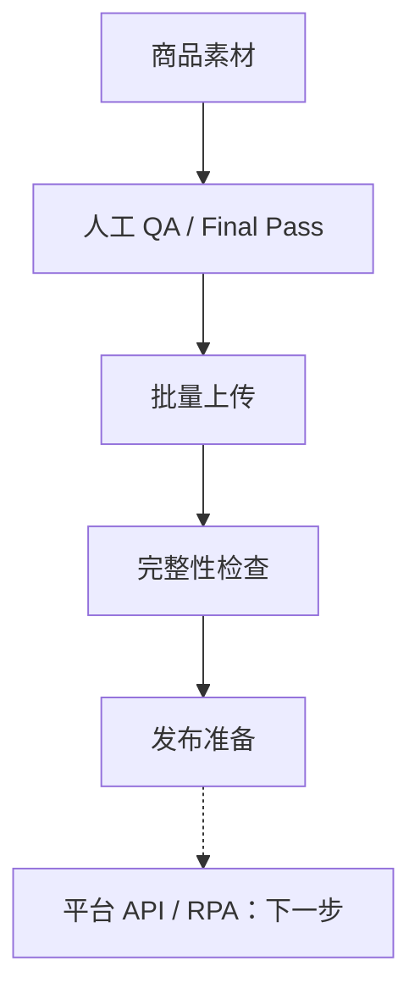

# AI Commerce Asset Ops

用于管理 AI 商品素材上传、完整性检查、QA 和发布状态的电商内部工具。

[English](./README_EN.md)

## 为什么做这个

这个项目来自一次跨境电商虚拟试戴项目。

前面的 AI 生成流程跑起来以后，我发现真正麻烦的不只是“把图生成出来”。一个 SKU 会对应多张不同肤色、视角的结果图，人工通过文件夹管理时，很容易少图、放错位置、不清楚哪些已通过审核，或者把已经上传的图片再传一遍。到了发布前，还要重新打开文件夹逐张核对。

所以我做了这个内部工具原型，把生成后的素材管理、QA 记录和发布准备集中起来。打开一个款式，就能看到已有多少张图、缺哪些位置，以及这次上传会新增、跳过还是覆盖哪些图片。

## 它现在能做什么

- 按三位数款式编号管理 SKU，创建和编辑名称、备注，以及可后补的 Shopify Variant ID。
- 用 4 种肤色 × 4 个视角的矩阵展示 16 张结果图，标出缺失图片和索引异常。
- 批量选择文件或文件夹，按文件名匹配位置；无法识别的文件可以手动指定。
- 差异上传，已有图片默认跳过；覆盖需要确认，并检查图片版本，防止覆盖别人刚更新的内容。
- 接收人工 Final Pass 后的图片，上传时记录 QA 通过状态、操作人和上传结果。
- 在浏览器中将 PNG/JPEG 转成 WebP；缩略图可以单独上传，也可以从 Light/01 生成后预览提交。
- 将图片存到 R2、索引和状态存到 D1，并根据已有图片补齐缺失的数据库索引。
- 管理草稿和发布状态；切换到发布前，检查 16 张结果图、缩略图及对应索引是否齐全。

## 使用流程



当前上传的都是人工终审后的图片，系统在入库时记录审核通过，不会在上传后再做一次视觉审核。界面里的“发布”目前更新内部状态，后续再对接商城发布。

例如，款式 001 已有 Light/01，其余 15 张缺失，页面会显示 1/16。放入整组图片后，已有位置默认跳过；需要换图时，再单独选择覆盖并确认。

## 界面

待补充脱敏后的 Upload Studio 实际截图，建议展示款式列表、图片矩阵和待上传统计。

<!-- 添加 docs/images/dashboard.png 后，取消下一行的注释。 -->
<!--  -->

## 技术实现

- Cloudflare Workers：API 和应用服务
- Cloudflare R2：图片文件
- Cloudflare D1：SKU、图片索引、QA 和发布状态、上传记录
- TypeScript：后端逻辑
- 原生 HTML、CSS、JavaScript：前端界面和浏览器图片处理

图片文件比较大，适合直接放在 R2。D1 保存图片属于哪个款式、对应哪个肤色和视角，以及审核和发布状态。这样，查一个 SKU 的素材情况时，可以直接查记录，不用人工翻文件夹。

但数据库有记录，不代表图片一定还在；图片上传成功，索引也可能写入失败。因此页面会同时核对 R2 文件和 D1 记录，提示不一致的位置，并提供补齐索引的操作。

## 一个我比较关注的设计点

RPA 不应该负责业务状态。如果后续接影刀等 RPA，我会让当前系统继续负责判断哪些素材完整、哪些通过审核、哪些可以发布，以及哪些执行失败。RPA 只负责具体的后台操作，例如打开商品编辑页、选择文件和提交。

有稳定 API 的平台优先接 API，没有 API 或旧系统再使用 RPA。无论用哪种方式，执行结果都要回写系统，避免状态散落在脚本和操作日志里。

## 本地运行

需要 Node.js 22 或更新版本。在仓库目录执行：

```bash
npm ci
npx wrangler d1 migrations apply asset-ops-db --local
npm run dev
```

开发命令已配置本地测试身份，图片和数据库使用 Wrangler 本地存储。检查类型、前端语法和集成测试：

```bash
npm run check
```

## 下一步

以下功能尚待实现：

- Shopify API 发布
- RPA 发布适配
- 发布任务队列和失败重试
- 更完整的审核与权限记录

## 项目说明

这是从真实业务问题中抽离出的公开展示版本，仓库不包含客户数据、生产凭证和商业素材。
