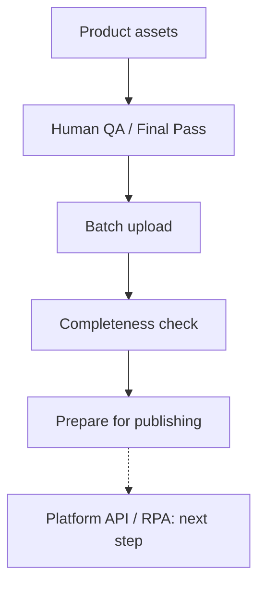

# AI Commerce Asset Ops

An internal e-commerce tool for uploading AI product assets, checking image coverage, and tracking QA and publishing status.

[中文](./README.md)

## Why I built this

This started with a cross-border e-commerce virtual try-on project.

Once the AI image generation workflow was running, I found that generating images was only part of the work. Each SKU needed several images across different skin tones and views. Managing them in folders made it easy to miss a file, assign it to the wrong slot, lose track of review status, or upload the same image twice. Preparing a style for release meant checking everything again by hand.

I built this internal tool prototype to bring asset uploads, QA records, and release preparation into one place. Selecting a style shows what is already there, what is missing, and which files a batch will add, skip, or replace.

## What it does

- Creates and edits styles using three-digit SKU identifiers, with names, notes, and an optional Shopify Variant ID that can be added later.
- Shows 16 result images in a four-tone × four-view matrix, highlighting missing images and index problems.
- Accepts batches of files or folders, matches filenames to image slots, and allows manual assignment when a filename cannot be matched.
- Skips existing images by default. Replacements require confirmation and a version check to avoid overwriting someone else's recent update.
- Accepts images that have passed human final review and records their QA status, uploader, and upload outcome.
- Converts PNG/JPEG images to WebP in the browser. Thumbnails can be uploaded separately or generated from Light/01 for preview before upload.
- Stores images in R2 and their records in D1, with a repair action to rebuild missing database indexes from existing images.
- Tracks draft and published status, checking all 16 images, the thumbnail, and their indexes before allowing a style to be marked published.

## Workflow



Human review happens before upload. The application records approval when an image is saved; it does not perform a second visual review. The publish button currently changes an internal status, with storefront publishing still to be connected.

For example, if style 001 has only Light/01, the screen shows 1/16 images. Adding a full batch skips that existing slot by default. To replace it, the operator selects overwrite and confirms the change.

## Interface

A screenshot of the actual Upload Studio will be added after removing private details. The most useful view would show the style list, image matrix, and pending upload counts.

<!-- Once docs/images/dashboard.png is added, uncomment the next line. -->
<!--  -->

## How it is built

- Cloudflare Workers: API and application serving
- Cloudflare R2: image files
- Cloudflare D1: SKUs, image indexes, QA and publishing status, upload records
- TypeScript: backend logic
- Plain HTML, CSS, and JavaScript: frontend and browser image processing

R2 holds the image files. D1 records which style, tone, and view each image belongs to, along with its QA and publishing status. This makes it possible to look up a SKU's assets without checking folders manually.

A database record does not guarantee that its image still exists, and an image upload can succeed while the database write fails. The interface checks both stores, flags mismatches, and provides an action to rebuild missing indexes.

## One design choice I care about

RPA should not own business status. If I add a tool such as Yingdao, I would keep decisions about completeness, review approval, publishing eligibility, and execution failures in this application. RPA would handle the actual admin actions: opening a product editor, selecting files, and submitting changes.

Where a platform provides a stable API, I would use it first. RPA would cover platforms without an API or older systems. Either way, execution results should come back to this application so status is not scattered across scripts and logs.

## Run locally

Requires Node.js 22 or newer. From the repository directory:

```bash
npm ci
npx wrangler d1 migrations apply asset-ops-db --local
npm run dev
```

The development command includes a local test identity and uses Wrangler's local image and database storage. To generate types and run syntax, type, and integration checks:

```bash
npm run check
```

## Next steps

These features are future work:

- Publishing through the Shopify API
- An RPA publishing adapter
- A publishing queue with retries
- More complete review and permission records

## About this version

This public version comes from a real business problem; it contains no customer data, production credentials, or commercial assets.
