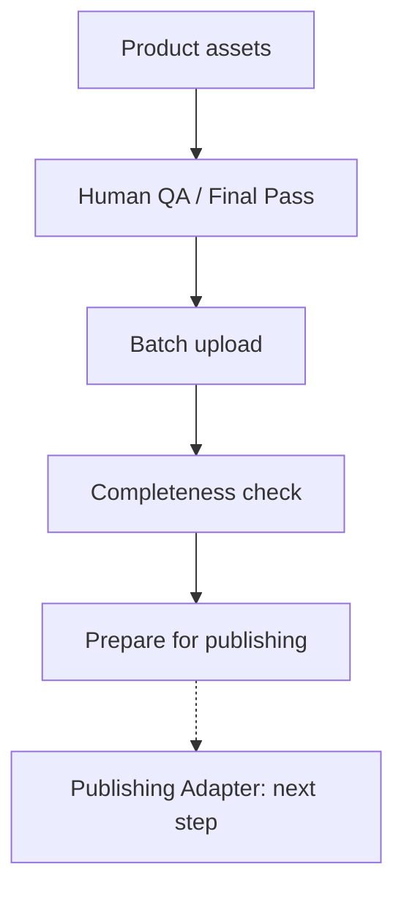

# AI Commerce Asset Ops

An internal e-commerce tool for uploading AI product assets, checking image coverage, and tracking QA and publishing status.

[中文](./README.md)

## Why I built this

This started with a cross-border e-commerce virtual try-on project.

Once the AI image generation workflow was running, I found that generating images was only part of the work. Each SKU needed several images across different skin tones and views. Managing them in folders made it easy to miss a file, assign it to the wrong slot, lose track of review status, or upload the same image twice. Preparing a style for release meant checking everything again by hand.

I built this internal tool prototype to bring asset uploads, QA records, and release preparation into one place. Selecting a style shows what is already there, what is missing, and which files a batch will add, skip, or replace.

## What it does

- Creates and edits styles using three-digit SKU identifiers, with names, notes, and an optional Shopify Variant ID that can be added later.
- Shows 16 result images in a four-tone × four-view matrix, highlighting missing images and index problems.
- Accepts batches of files or folders, matches filenames to image slots, and allows manual assignment when a filename cannot be matched.
- Skips existing images by default. Replacements require confirmation and a version check to avoid overwriting someone else's recent update.
- Accepts images that have passed human final review and records their QA status, uploader, and upload outcome.
- Converts PNG/JPEG images to WebP in the browser. Thumbnails can be uploaded separately or generated from Light/01 for preview before upload.
- Stores images in R2 and their records in D1, with a repair action to rebuild missing database indexes from existing images.
- Tracks draft and published status, checking all 16 images, the thumbnail, and their indexes before allowing a style to be marked published.

## Workflow



The application handles asset intake, coverage checks, QA records, operational state, and release readiness. Images pass human final review before upload, and approval is recorded when they are saved. The publish button changes an internal release/readiness state; it does not publish to Shopify or another external platform. Actual publishing belongs to a future downstream integration and adapter layer.

For example, if style 001 has only Light/01, the screen shows 1/16 images. Adding a full batch skips that existing slot by default. To replace it, the operator selects overwrite and confirms the change.

## Interface

The actual Upload Studio with private details removed: the style list, 1/16 image coverage, a separate thumbnail, and the image status matrix.


## How it is built

- Cloudflare Workers: API and application serving
- Cloudflare R2: image files
- Cloudflare D1: SKUs, image indexes, QA and publishing status, upload records
- TypeScript: backend logic
- Plain HTML, CSS, and JavaScript: frontend and browser image processing

## Why assets and business state are stored separately

R2 stores binary image files. D1 stores the SKU, tone/view slot, QA status, and release state. The file tells us where an image is; the database tells us where it belongs, whether it has passed human review, and the style's current status. These records can be queried and updated without processing the image again.

The two stores can disagree: an upload may succeed while its index write fails, or a database record may remain after its file is gone. Readiness therefore cannot depend on file existence alone. The application checks both R2 objects and D1 indexes, flags mismatches, and can rebuild missing indexes. Moving a draft to published requires all 16 images, the thumbnail, and their indexes. QA approval comes from human review before upload and is recorded on save.

## Run locally

Requires Node.js 22 or newer. From the repository directory:

```bash
npm ci
npx wrangler d1 migrations apply asset-ops-db --local
npm run dev
```

The development command includes a local test identity and uses Wrangler's local image and database storage. To generate types and run syntax, type, and integration checks:

```bash
npm run check
```

## Next steps

These features are future work:

- A Shopify / commerce platform publishing adapter
- A publishing queue with retries
- Webhook / ERP / downstream system integration
- More complete review and permission records

## About this version

This public version comes from a real business problem; it contains no customer data, production credentials, or commercial assets.
